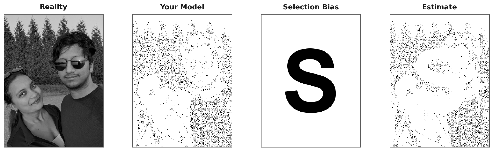

```{python}
#| label: final-meme-pipeline
#| echo: false
#| message: false
#| warning: false
#| output: false

from pathlib import Path

from step1_prepare_image import prepare_image
from step2_create_stipple import create_stipple
from step3_create_tonal import create_tonal
from step4_create_block_letter import create_block_letter_s
from step5_create_masked import create_masked_stipple
from create_meme import create_statistics_meme

img_path = "submission_photo.png"
if not Path(img_path).exists():
    img_path = "fleischhacker.jpg"

gray_image = prepare_image(img_path, max_size=512)

_, _, tonal_stats = create_tonal(
    gray_image, grid_rows=16, grid_cols=12, return_full_image=True
)
mean_tone = float(tonal_stats["mean"])

stipple_pattern, _samples = create_stipple(
    gray_image,
    percentage=0.08,
    sigma=0.9,
    content_bias=0.9,
    noise_scale_factor=0.1,
    extreme_downweight=0.55 if mean_tone > 0.55 else 0.45,
    extreme_threshold_low=0.15,
    extreme_threshold_high=0.88,
    extreme_sigma=0.1,
)

h, w = gray_image.shape
block_letter = create_block_letter_s(h, w, letter="S", font_size_ratio=0.88)
masked_stipple = create_masked_stipple(
    stipple_pattern, block_letter, threshold=0.5
)

create_statistics_meme(
    original_img=gray_image,
    stipple_img=stipple_pattern,
    block_letter_img=block_letter,
    masked_stipple_img=masked_stipple,
    output_path="statistics_meme.png",
    dpi=200,
    background_color="white",
)
```



This meme illustrates selection bias by treating **Reality** as the full population, the stippled **Your Model** as the data we observe, and **Estimate** as what we would conclude from that data after some observations disappear. The letter **S** stands for **systematic** missingness—information removed in a fixed, repeating pattern rather than at random—so the final panel can diverge from **Reality** even when the analysis itself is sensible. The same idea applies in real studies when who is included or excluded follows a rule (response, access, eligibility), producing samples that may not represent the population we intend to describe.
